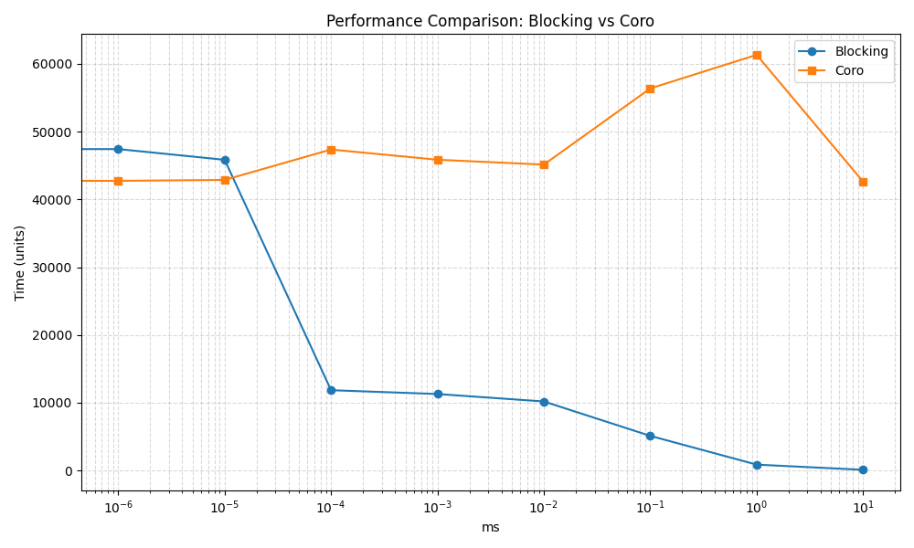

# Coroutine HTTP Server

<!-- - ~~Stackless coroutines with symmetric transfer~~ -->

A coroutine-based HTTP server modeled after [archibate/co_async](https://github.com/archibate/co_async).

# Design

Task management:

1. Create an entrypoint task.
2. This task may spawn other tasks, leaving them in different schedulers.
3. A task is either running, staying in schedulers to be resumed, or cancelled.
4. Schedulers collaborate and the entrypoint task finally finishes.

Schedulers:

- `TimedScheduler`
  - Stores coroutines waiting for time.
  - e.g. `sleep_for` and `sleep_until`.
- `EpollScheduler` (Blocking)
  - Stores coroutines waiting for files to become ready.
  - e.g. `AsyncFile`, `wait_file_event`, etc.
  - NOTE: Instead of registering function pointers to `epoll_event`, every waiter registers a `EpollFilePromise*`. When epoll signals an event, it provides us with a coroutine handle to resume. Unlike a standard function pointer, when a coroutine returns from the `resume()` call, it does not necessarily reach its conclusion. It can be launched, but not finished.

A blocking scheduler should be put at the end of a loop, making sure that there're no other tasks that are ready to run. They normally come with a timeout so we can check for new tasks.

File operations:

- `AsyncFile` is to a file descriptor what `std::unique_ptr` is to a raw pointer.
- `AsyncFileStream` serves as a wrapper for `AsyncFile`, analogous to how `FILE*` operates. The operations encapsulates `getc` and `putc` around a `FILE*` that is associated with non-blocking file descriptors.
- `AsyncFileBuffer` maintains a buffer itself and interact directly with `read()`/`write()` so it can get more accurate feedback on errors and work potentially better.

Utilities:

- `when_all` and `when_any`
    - They both assume the tasks passed as arguments are not in the scheduler.
    - When the last task of the `when_all` group finishes, it awakes the previous suspended task (which is waiting for `when_all` coroutine to finish).
    - When the first task finishes, `when_any` destroys the other tasks by returning from the coroutine body and letting the temporary tasks' destructors destroy the coroutine handles and remove them from the scheduler.

# Build

First, download googletest:

```bash
git submodule add https://github.com/google/googletest.git extern/googletest
git submodule update --init --recursive
```

> [!CAUTION]
> You should run `git submodule add` at the root of the project's workspace.

Second, download this dependency (this library translates http status codes to strings):

```bash
git submodule add https://github.com/j-ulrich/http-status-codes-cpp.git extern/http_status_code
git submodule update --init --recursive
```

<!-- Install `liburing` by `sudo apt install liburing-dev`. -->

Then run cmake commands to build the project. (You can run unit tests in the build directory by running `ctest`.)

Development setup:

- Compiler: GCC 13.3.0
- System: Ubuntu 24.04.1 LTS (WSL2)
- CPU: Intel® Core™ Ultra 9 Processor 185H

# Results

Compile flags: `-O2 -g`.

When the program is almost always I/O-ready:

```bash
wrk -t12 -c1000 -d20s http://localhost:9000/repeat\?count\=10000
```

- Blocking version (example/server_blocking.cpp): **Requests/sec:  42020.76**
- Coroutine version (example/server_epoll_coro.cpp): **Requests/sec:  33691.99**

In this case, coroutines and non-blocking I/O make the performance worse!

When the program needs to wait for other time-consuming operations:

```bash
wrk -t12 -c1000 -d20s http://localhost:9000/sleep\?ms\=<ms>
```
| ms       | 0        | 1e-6     | 1e-5     | 1e-4     | 1e-3     | 1e-2     | 0.1      | 1        | 10       |
| -------- | -------- | -------- | -------- | -------- | -------- | -------- | -------- | -------- | -------- |
| blocking | 54294.19 | 47433.17 | 45850.88 | 11849.45 | 11283.70 | 10186.02 | 5107.66  | 865.31   | 96.58    |
| coro     | 45168.30 | 42747.37 | 42881.30 | 47369.20 | 45861.48 | 45144.80 | 56382.97 | 61340.93 | 42636.99 |



It's interesting that when coroutines sleep for a while, they work better 😂. I suspect that when they are not scheduled immediately, `epoll_wait()` + `accept()` can accept more incoming connections. It's like calling more people into a restaurant. They just end up waiting a long time for their food to arrive and having a bad experience, but the restaurant earns more.

For reference, [archibate/co_async/example/server.cpp](https://github.com/archibate/co_async/blob/master/examples/server.cpp) achieves 81044.05 requests/s in my test. Probably due to io_uring?

To further improve the performance, I can still:

- Utilize a thread pool.
  - Currently the project only gives a demo in a single thread.
- Switch to liburing-based I/O.
  - Imagine io_uring as a way of issuing async syscalls to the Linux kernel without doing it directly in your program (`epoll_wait()` + `read()`/`write()`). Not only the number of syscalls is greatly reduced, you don't have to wait for `read()`/`write()` to finish. Moreover, io_uring supports zero-copy.

# Details to Share

- [Some of the task model's design details](./doc/coro_impl_details.md)
- [How did I improve the output throughput of `AsyncFileBuffer` (6008.07 → 33691.99 qps)](./doc/puts_throughput.md)


# Resources

- [C++ Coroutines: Understanding Symmetric Transfer](https://lewissbaker.github.io/2020/05/11/understanding_symmetric_transfer)
- https://github.com/archibate/co_async
- [Lord of the io_uring](https://unixism.net/loti/index.html)