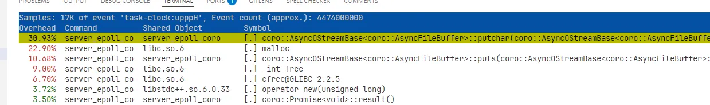
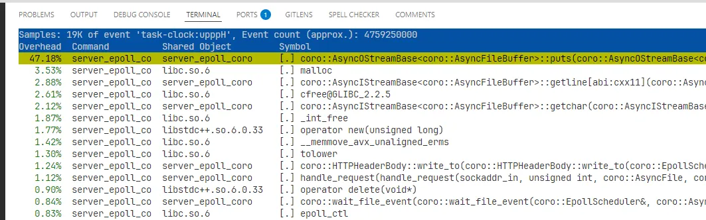
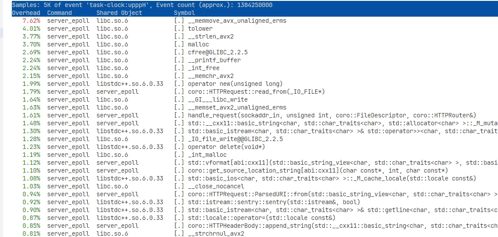
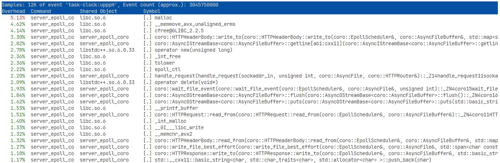

# Optimizing output throughput

## Avoid `co_await putchar()`

When sending a response of 10,000 bytes, the blocking version of the server has a better throughput:

```bash
➜  ~ wrk -t12 -c1000 -d20s http://localhost:9001/repeat\?count\=10000
Running 20s test @ http://localhost:9001/repeat?count=10000
  12 threads and 1000 connections
  Thread Stats   Avg      Stdev     Max   +/- Stdev
    Latency    31.09ms   55.66ms 600.43ms   97.55%
    Req/Sec     3.60k   632.90     5.62k    78.91%
  866268 requests in 20.62s, 8.12GB read
  Socket errors: connect 0, read 866256, write 0, timeout 0
Requests/sec:  42020.76
Transfer/sec:    403.43MB
```

Here is the result of the coroutine/async version：

```bash
➜  ~ wrk -t12 -c1000 -d20s http://localhost:9000/repeat\?count\=10000
Running 20s test @ http://localhost:9000/repeat?count=10000
  12 threads and 1000 connections
  Thread Stats   Avg      Stdev     Max   +/- Stdev
    Latency   170.60ms   68.03ms 746.94ms   96.23%
    Req/Sec   521.54    278.65     3.45k    54.79%
  124100 requests in 20.66s, 1.16GB read
  Socket errors: connect 0, read 124099, write 0, timeout 0
Requests/sec:   6008.07
Transfer/sec:     57.68MB
```

I run `perf` command to collect the statistics, and find that most of time is spent in `putchar()`:



Actually the test never invokes `putchar()` directly, but it calls `puts()`. Here's the code:

```cpp
Task<> puts(std::string_view sv) {
  for (char ch : sv) {
    co_await putchar(ch);
  }
}
```

Obviously the compiler didn't inline `putchar()`, even though I think it's small enough (but may be large in the compiler's view). I change the code to this:

```cpp
Task<> puts(std::string_view sv) {
  std::size_t i = 0;
  std::size_t n = sv.size();
  while (i < n) {
    assert(capacity_ >= end_);
    std::size_t can_write = std::min(capacity_ - end_, n - i);
    if (!can_write) {
      co_await flush();
      continue;
    }
    while (can_write-- > 0) {
      buffer_[end_++] = sv[i++];
    }
  }
}
```

The output instantly becomes much better:

```bash
➜  ~ wrk -t12 -c1000 -d20s http://localhost:9000/repeat\?count\=10000
Running 20s test @ http://localhost:9000/repeat?count=10000
  12 threads and 1000 connections
  Thread Stats   Avg      Stdev     Max   +/- Stdev
    Latency    42.63ms    4.18ms  56.76ms   75.47%
    Req/Sec     1.95k   307.41     5.87k    82.94%
  467317 requests in 20.07s, 4.38GB read
  Socket errors: connect 0, read 467316, write 0, timeout 0
Requests/sec:  23283.74
Transfer/sec:    223.54MB
```

Now when I `perf` the program again, the `putchar()` line disappears from the top.



> [!TIP]
> I think it's a problem to reuse code pieces when coroutine comes into play. Normally we wrap the logic into a function and call it many times and rely on the compiler to optimize the code for us. But when we need `co_await` in the logic, the function becomes a coroutine and is hard to optimized out. I have to copy these code pieces multiple times to perform manual-inlining. Macros are not neat, since they bring assumptions of variable names and it's difficult to avoid name conflicts.

**Requests/sec: 6008.07 → 23283.74**.

## Replace hand-written copying with `memcpy()`

When I take a look at the blocking server's `perf` result, I observe that there is no function with a significantly high ratio. There's a screenshot:



I try to use `memcpy()` in `puts()`, and the code becomes:

```cpp
  Task<> puts(std::string_view sv) {
    std::size_t i = 0;
    std::size_t n = sv.size();
    while (i < n) {
      assert(capacity_ >= end_);
      std::size_t can_write = std::min(capacity_ - end_, n - i);
      if (!can_write) {
        co_await flush();
        continue;
      }
      std::memcpy(&buffer_[end_], &sv[i], can_write);
      end_ += can_write;
      i += can_write;
    }
  }
```

Again, the QPS becomes better.

```bash
➜  ~ wrk -t12 -c1000 -d20s http://localhost:9000/repeat\?count\=10000
Running 20s test @ http://localhost:9000/repeat?count=10000
  12 threads and 1000 connections
  Thread Stats   Avg      Stdev     Max   +/- Stdev
    Latency    29.46ms    3.64ms  51.86ms   92.05%
    Req/Sec     2.83k     0.99k   47.43k    99.71%
  676144 requests in 20.07s, 6.34GB read
  Socket errors: connect 0, read 676143, write 0, timeout 0
Requests/sec:  33691.99
Transfer/sec:    323.47MB
```

Now I check the `perf` result again and find that `puts` disappears.



**Requests/sec: 23283.74 → 31616.07**.

## `puts` didn't scale

When I increase the response size from 10000 to 100000 bytes, the performance of my coroutine server degenerates.

```bash
➜  ~ wrk -t12 -c1000 -d20s http://localhost:9000/repeat\?count\=100000
Running 20s test @ http://localhost:9000/repeat?count=100000
  12 threads and 1000 connections
  Thread Stats   Avg      Stdev     Max   +/- Stdev
    Latency   120.69ms   59.25ms 665.08ms   96.51%
    Req/Sec   739.50    196.41     4.69k    87.25%
  177604 requests in 20.64s, 16.55GB read
  Socket errors: connect 0, read 177603, write 0, timeout 0
Requests/sec:   8603.28
Transfer/sec:    821.04MB
```

However, the normal `puts` (from <stdio.h>) still maintain a high QPS.

```bash
➜  ~ wrk -t12 -c1000 -d20s http://localhost:9001/repeat\?count\=100000
Running 20s test @ http://localhost:9001/repeat?count=100000
  12 threads and 1000 connections
  Thread Stats   Avg      Stdev     Max   +/- Stdev
    Latency    38.38ms   54.04ms 592.51ms   97.61%
    Req/Sec     2.71k   315.33     3.35k    81.16%
  650036 requests in 20.56s, 60.58GB read
  Socket errors: connect 0, read 650029, write 0, timeout 0
Requests/sec:  31616.07
Transfer/sec:      2.95GB
```

If the output size is too large, we shouldn't write it to the buffer in the beginning, knowing that we'll soon flush it by calling `write()`. The modified code:

```cpp
  Task<> puts(std::string_view sv) {
    // If the buffer is not enough, there is definitely a flush.
    // We can flush immediately and then call write() directly to avoid
    // unnecessary data copying.
    if (capacity_ - end_ < sv.size()) {
      if (end_) {
        co_await flush();
      }
      auto sp = std::span{sv.data(), sv.size()};
      co_await write_buffer(sp);
      co_return;
    }
    std::size_t i = 0;
    std::size_t n = sv.size();
    while (i < n) {
      assert(capacity_ >= end_);
      std::size_t can_write = std::min(capacity_ - end_, n - i);
      if (!can_write) {
        co_await flush();
        continue;
      }
      std::memcpy(&buffer_[end_], &sv[i], can_write);
      end_ += can_write;
      i += can_write;
    }
  }
```

New performance:

```bash
➜  ~ wrk -t12 -c1000 -d20s http://localhost:9000/repeat\?count\=100000
Running 20s test @ http://localhost:9000/repeat?count=100000
  12 threads and 1000 connections
  Thread Stats   Avg      Stdev     Max   +/- Stdev
    Latency    47.07ms   51.63ms 583.52ms   97.66%
    Req/Sec     2.08k   650.64    29.84k    99.21%
  501428 requests in 20.59s, 46.73GB read
  Socket errors: connect 0, read 501426, write 0, timeout 0
Requests/sec:  24351.97
Transfer/sec:      2.27GB
```

**Requests/sec: 8603.28 → 24351.97.**